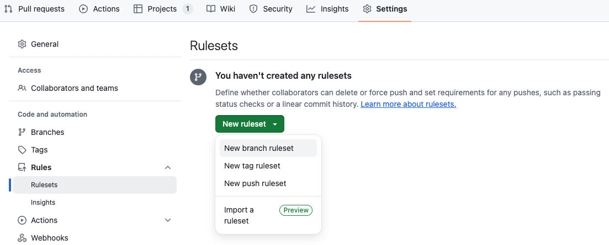
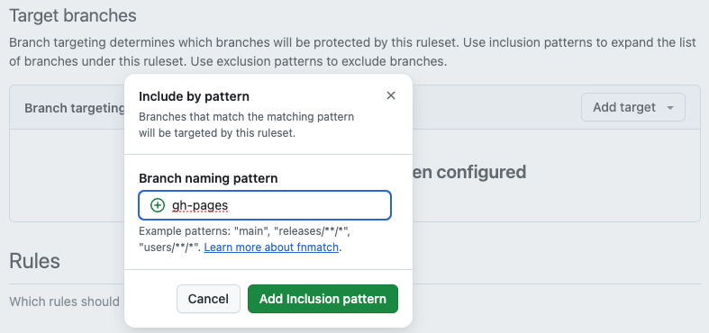
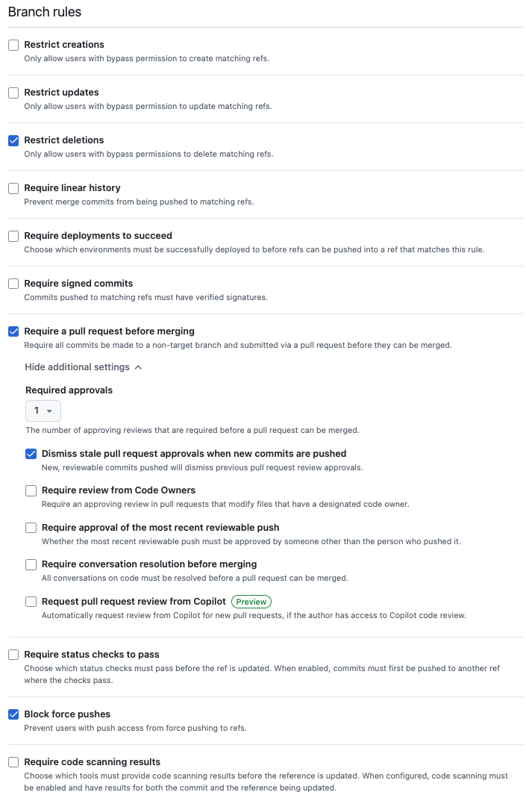

# Branch Protections

Is your project going public? Are you releasing a package or tool for general use? Then it's time to think about adding branch protections to `main`.

## What are branch protections and why do we need them?

Branch protections are essentially a more formalized implementation of contributing guidelines for your repository. This could be anything from requiring a pull request before pushing or merging updates to `main`, to requiring approval by particular parties before merging a pull request. For more information on branch protections, see GitHub's docs on [branch protection rules](https://docs.github.com/en/repositories/configuring-branches-and-merges-in-your-repository/managing-protected-branches/about-protected-branches). 

Generally speaking, once the set of potential users exceeds that of repository developers (i.e., the repo goes public), it is wise to apply branch protections, especially for the `main` branch of the repo. The primary purpose is to--at a minimum--alert developers of changes prior to their implementation. For more information on potential branch protection rules, see GitHub's [docs](https://docs.github.com/en/repositories/configuring-branches-and-merges-in-your-repository/managing-protected-branches/managing-a-branch-protection-rule).

## How to Implement Branch Protections

From your repository, navigate to "Settings" and select "Branches" from the left toolbar. Provide the name of the branch you would like to protect, for instance `main`, and select the rules that you want applied to the branch. It is also possible to set the rules for branches matching a particular pattern (eg., type `*release*` to apply the rules to any branch containing the word `release`). You can also edit branch protection rules from this page.

The example below shows the addition of branch protection rules for `main` that require a pull request and that it be approved prior to merging. It also will remove approval if other changes are added that require approval.

### Example Branch Protection Rules for `main`

{ loading=lazy }
/// caption
///

## How to Implement Rulesets (Newer Version of Branch Protections)

From your repository, navigate to "Settings" and select "Rules" from the left toolbar. Click on "New ruleset" and select the type you wish to create ("New branch ruleset" is the ruleset equivalent to branch protections). 

{ loading=lazy }
/// caption
///

Here we have selected "New branch ruleset", and named it "published-branch", as we will be applying it to our publication branches (i.e., `main` and `gh-pages`). Be sure to select "Active" to enable the protections.

{ loading=lazy }
/// caption
///

We choose to apply these to the default branch (`main` or `master`). 

{ loading=lazy }
/// caption
///

As with branch protections, it is also possible to set the rules for branches matching a particular pattern (eg., type `*release*` to apply the rules to any branch containing the word `release`). We will do this for `gh-pages`.

{ loading=lazy }
/// caption 
///

You can also edit branch rulesets from this page.
The example below shows the addition of a branch ruleset that requires a pull request and that it be approved prior to merging. It also will remove approval if other changes are added that require approval. This is equivalent to the branch protection example given above.

!!! note "Note"
    If your site is generated from `main`, you should create a separate ruleset for `gh-pages` that protects against deletions and force pushes (but does not require PRs). This is relevant when generating a site with tools like MkDocs.

{ loading=lazy }
/// caption
///
